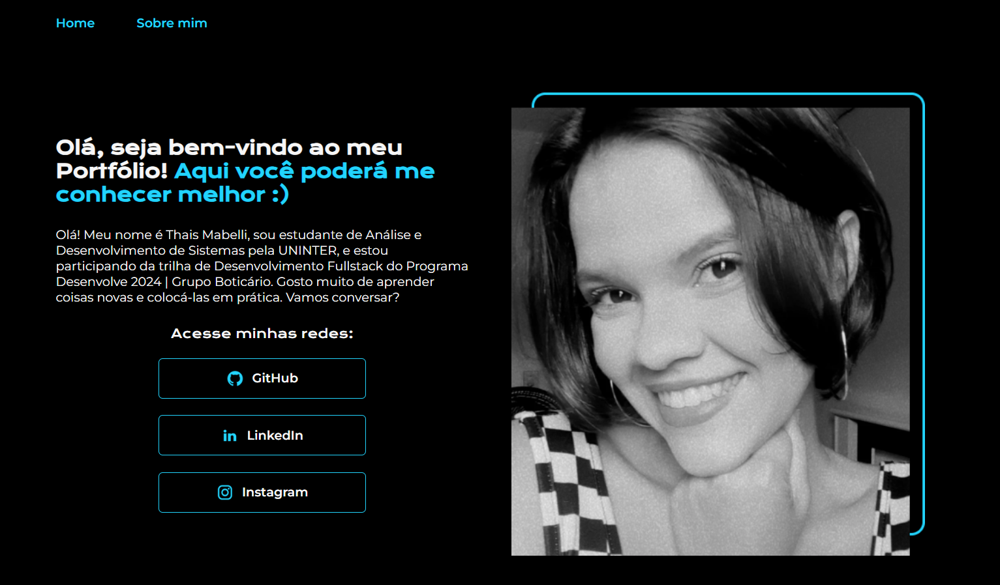

<h1 align="center"> Projeto: Portfólio </h1>

  <a href="#-tecnologias">Tecnologias</a>&nbsp;&nbsp;&nbsp;&nbsp;&nbsp;&nbsp;

 

  

## 🚀 Tecnologias

Esse portfólio foi desenvolvido com as seguintes tecnologias:

- HTML e CSS
- Git e Github

## 💻 Projeto

Projeto desenvolvido no Programa Desenvolve 2024 | Grupo Boticário, em parceria com Alura. Foi realizado um portfólio utilizando HTML e CSS.

## :memo: Licença

Esse projeto está sob a licença MIT.

---
  Desenvolvido por Thais Mabelli [Programa Desenvolve 2024 | Grupo Boticário]
